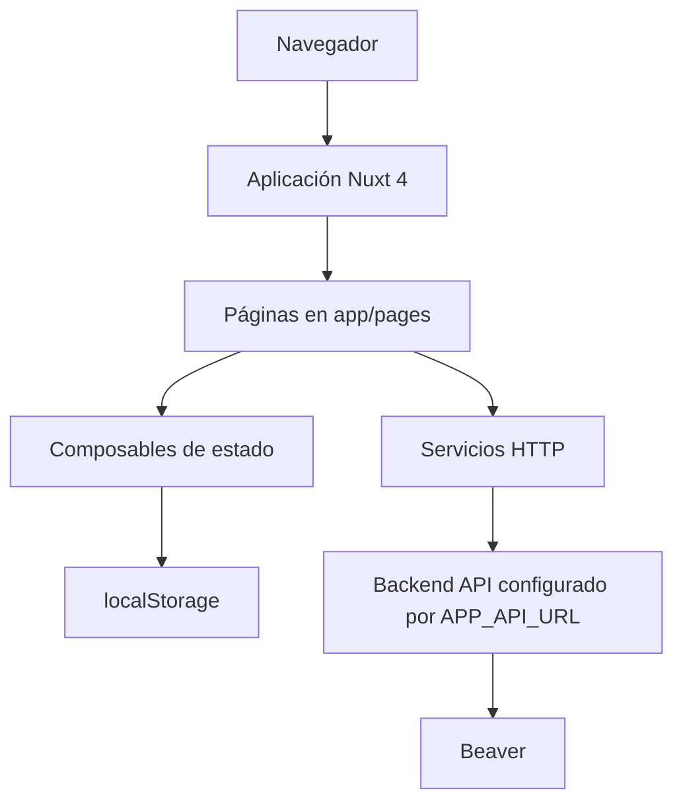
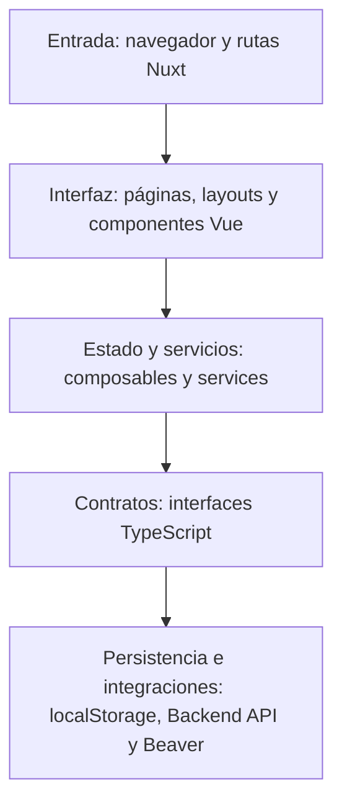
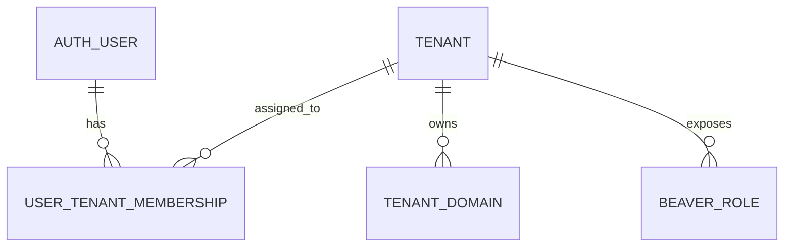
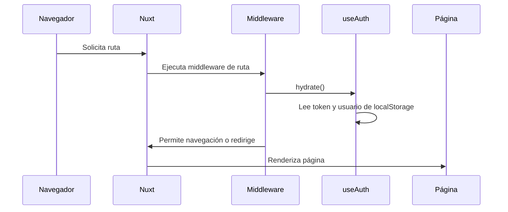
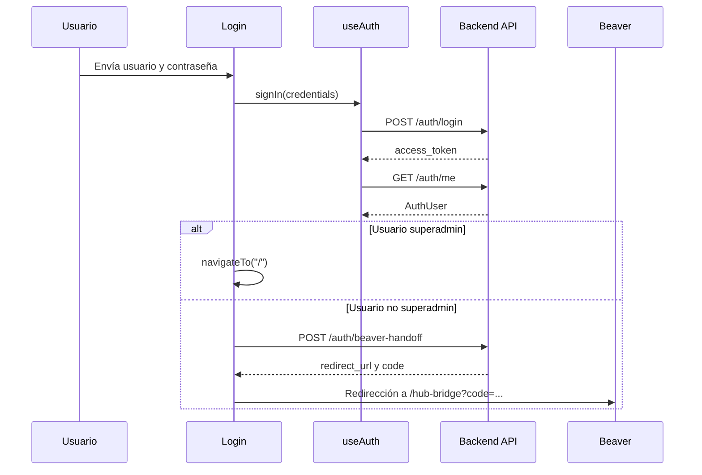
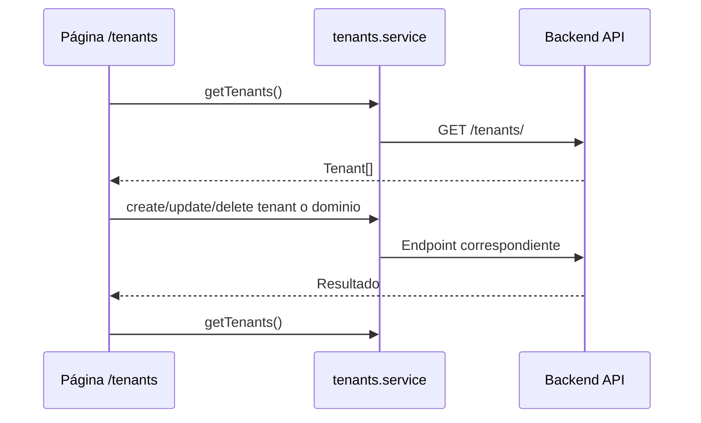
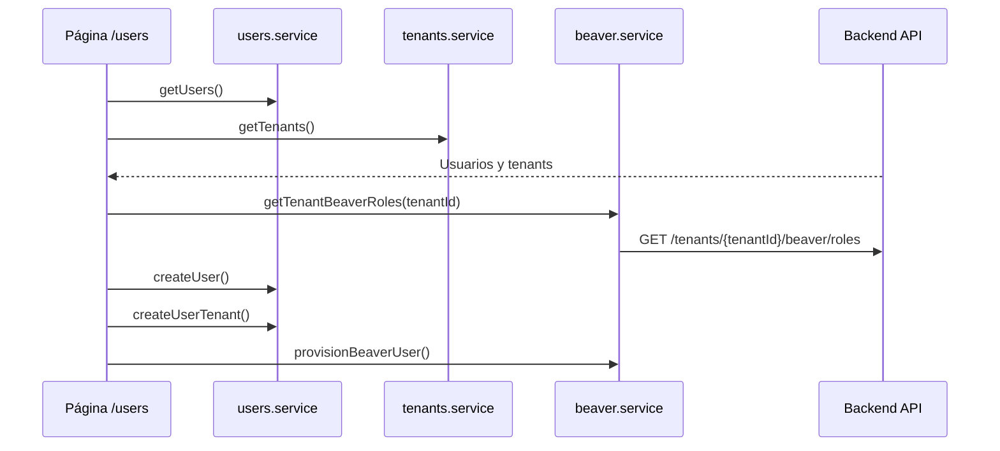

# Memoria técnica de IOTFRONT

## Introducción

IOTFRONT es el frontend Nuxt del entorno Xercode IoT. El proyecto proporciona una interfaz web para la administración de tenants, dominios, usuarios, pertenencias por tenant e integración operativa con Beaver. La aplicación actúa como cliente de un backend externo, consumiendo endpoints HTTP configurados mediante variable de entorno.

El repositorio contiene una aplicación Vue/Nuxt orientada a administración privada. La navegación principal queda protegida por middleware de autenticación y por comprobación de perfil superadministrador.

## Objetivo del documento

Este documento describe la arquitectura, configuración, módulos, contratos TypeScript, ejecución, despliegue e integraciones identificadas en el proyecto. La memoria está redactada como entregable técnico para cliente y equipo de desarrollo, con foco en cómo está construido el sistema y cómo se relacionan sus partes.

## Alcance del proyecto

El alcance confirmado por código incluye:

| Área | Descripción |
| --- | --- |
| Autenticación | Inicio de sesión contra backend, obtención de usuario autenticado y almacenamiento de token en navegador. |
| Dashboard privado | Vista inicial para usuarios superadministradores con acceso a tenants y usuarios. |
| Gestión de tenants | Listado, creación, edición y eliminación de tenants. |
| Gestión de dominios | Administración de dominios asociados a tenants. |
| Gestión de usuarios | Listado, creación y edición básica de usuarios. |
| Membresías | Gestión de pertenencias de usuarios a tenants, roles HUB y roles Beaver. |
| Beaver | Obtención de roles, provisionamiento de usuario, cambio de contraseña y handoff desde login para usuarios no superadministradores. |
| Layout y UI | Layout público de login, layout autenticado, sidebar, header, modales, tablas, alertas y componentes reutilizables. |

El proyecto no contiene backend, migraciones ni persistencia propia. La persistencia funcional reside en servicios externos consumidos mediante API HTTP.

## Arquitectura general

| Capa | Elementos identificados | Función |
| --- | --- | --- |
| Entrada | Navegador, rutas Nuxt en `app/pages` | Presentar vistas y capturar acciones de usuario. |
| Routing/interfaz | `app/pages`, `app/layouts`, middleware Nuxt | Resolver páginas, aplicar layouts y proteger rutas. |
| Servicios | `app/services/*.service.ts` | Encapsular llamadas HTTP al backend. |
| Estado compartido | `app/composables/useAuth.ts`, `app/composables/useNotifications.ts`, `app/composables/useApi.ts` | Mantener sesión, notificaciones y cliente API. |
| Dominio/contratos | `app/services/types.ts` | Definir interfaces TypeScript para usuarios, tenants, dominios, membresías y Beaver. |
| Persistencia local | `app/utils/storage.ts` | Guardar token y usuario en `localStorage` del navegador. |
| Integraciones | Backend configurado con `APP_API_URL`, Beaver a través de endpoints del backend | Consumir datos y operaciones externas. |
| Tests | No se han localizado ficheros `*.test.*` o `*.spec.*` fuera de carpetas ignoradas | No hay suite automatizada confirmada en el repositorio. |
| Despliegue | `Dockerfile`, scripts npm, Nuxt/Nitro | Build y ejecución de producción. |





## Estructura de directorios

Árbol relevante del proyecto:

```text
.
├── app/
│   ├── app.vue
│   ├── assets/css/
│   ├── components/
│   │   ├── layout/
│   │   ├── tenants/
│   │   ├── ui/
│   │   └── users/
│   ├── composables/
│   ├── layouts/
│   ├── middleware/
│   ├── pages/
│   │   ├── index.vue
│   │   ├── login.vue
│   │   ├── tenants/index.vue
│   │   └── users/
│   ├── services/
│   └── utils/
├── public/
│   ├── fonts/
│   └── images/
├── Dockerfile
├── nuxt.config.ts
├── package.json
├── package-lock.json
├── README.md
└── tsconfig.json
```

## Tecnologías utilizadas

| Tecnología | Versión confirmada | Uso |
| --- | --- | --- |
| Nuxt | `^4.4.2` en `package.json` | Framework principal de aplicación frontend. |
| Vue | `^3.5.33` en `package.json` | Construcción de componentes y estado reactivo. |
| Vue Router | `^5.0.6` en `package.json` | Enrutamiento usado por Nuxt. |
| TypeScript | Configurado por `tsconfig.json` y componentes `lang="ts"` | Tipado de servicios, contratos y lógica de componentes. |
| Vite | Integrado por Nuxt y configurado en `nuxt.config.ts` | Build y optimización de dependencias. |
| Node.js | Imagen `node:20-alpine` en `Dockerfile` | Build y ejecución de producción. |
| Nitro/Nuxt output | `.output/server/index.mjs` en `Dockerfile` | Servidor de producción generado por Nuxt. |
| npm | Scripts en `package.json` | Ejecución de desarrollo, build, generación y preview. |

## Configuración del entorno

| Variable o archivo | Valor por defecto | Uso |
| --- | --- | --- |
| `APP_API_URL` | `http://localhost:8000` en `nuxt.config.ts` | URL base del backend consumido por `useApi`. |
| `nuxt.config.ts` | No aplica | Configura fecha de compatibilidad, devtools, CSS global, cabecera HTML, runtimeConfig y optimización Vite. |
| `.env` | No se documenta valor real | Archivo local ignorado por Git que puede definir `APP_API_URL`. |
| `public/fonts` | No aplica | Fuentes precargadas desde la cabecera de Nuxt. |
| `public/images` | No aplica | Logos, favicon e isotipos usados por la interfaz. |

La configuración pública de Nuxt expone `config.public.apiUrl`, que es usada por `app/composables/useApi.ts` como `baseURL` para todas las llamadas `$fetch`.

## Punto de entrada y ciclo de arranque

El punto de entrada visual es `app/app.vue`. Este componente obtiene la ruta activa, deriva `title` y `description` desde `route.meta`, aplica `useSeoMeta` y renderiza `NuxtLayout` con `NuxtPage`.

El ciclo de arranque funcional es:

1. Nuxt carga la aplicación y resuelve la ruta solicitada.
2. Si la página define middleware, Nuxt ejecuta `auth`, `guest` o `superadmin`.
3. `useAuth().hydrate()` recupera token y usuario desde `localStorage` cuando se ejecuta en cliente.
4. La página renderiza su layout y componentes.
5. Las vistas cargan datos con servicios ubicados en `app/services`.

Comandos principales:

| Comando | Propósito |
| --- | --- |
| `npm run dev` | Arranca servidor de desarrollo Nuxt. |
| `npm run build` | Genera build de producción. |
| `npm run generate` | Genera salida estática si la configuración del proyecto lo permite. |
| `npm run preview` | Sirve localmente la build generada. |
| `npm run postinstall` | Ejecuta `nuxt prepare`. |

## Persistencia y datos

El repositorio no contiene modelos ORM, migraciones ni conexión directa a base de datos. Los datos funcionales se obtienen desde un backend externo.

La persistencia local confirmada está en `app/utils/storage.ts`:

| Clave | Contenido | Uso |
| --- | --- | --- |
| `token` | Token de autenticación | Se usa para añadir cabecera `Authorization: Bearer ...` en `useApi`. |
| `user` | Usuario autenticado serializado en JSON | Permite hidratar estado básico de sesión en cliente. |



El diagrama anterior representa contratos e inferencia técnica a partir de las interfaces TypeScript y servicios HTTP. No representa tablas locales del frontend.

## Modelos, entidades o contratos principales

Los contratos principales están definidos en `app/services/types.ts`:

| Contrato | Campos destacados | Uso |
| --- | --- | --- |
| `AuthUser` | `id`, `username`, `email`, `tenant_id`, `is_superadmin` | Usuario autenticado y control de navegación. |
| `LoginPayload` | `username`, `password` | Entrada del formulario de login. |
| `LoginResponse` | `access_token`, `token_type` | Respuesta de autenticación. |
| `BeaverHandoffResponse` | `redirect_url`, `code` | Redirección a Beaver para usuarios no superadministradores. |
| `Tenant` | `id`, `name`, `code`, `address`, `redirect_url`, `beaver_base_url`, `beaver_mqtt_host`, `is_active`, `domains` | Gestión administrativa de tenants. |
| `TenantPayload` | Datos editables de tenant | Creación y actualización de tenants. |
| `TenantDomain` | `id`, `domain`, `is_primary` | Dominios asociados a tenants. |
| `User` | `id`, `username`, `email`, `is_active`, `is_superadmin`, `tenants` | Gestión de usuarios. |
| `UserPayload` | `username`, `email`, `password`, `is_active`, `is_superadmin` | Creación y edición de usuarios. |
| `UserTenantMembership` | `user_id`, `tenant_id`, `role`, `beaver_role_id`, `is_active` | Relación entre usuario y tenant. |
| `BeaverRole` | `id`, `role_id`, `name`, `display_name` | Roles recuperados para un tenant desde Beaver vía backend. |

## Interfaces disponibles

### Rutas de aplicación

| Ruta Nuxt | Fichero | Middleware | Propósito |
| --- | --- | --- | --- |
| `/login` | `app/pages/login.vue` | `guest` | Login de usuarios y redirección a dashboard o Beaver. |
| `/` | `app/pages/index.vue` | `auth`, `superadmin` | Dashboard privado con accesos a tenants y usuarios. |
| `/tenants` | `app/pages/tenants/index.vue` | `auth`, `superadmin` | Gestión de tenants y dominios. |
| `/users` | `app/pages/users/index.vue` | `auth`, `superadmin` | Gestión y filtrado de usuarios. |
| `/users/:id/memberships` | `app/pages/users/[id]/memberships.vue` | `auth`, `superadmin` | Gestión de membresías, roles Beaver y contraseñas Beaver por tenant. |

### Servicios HTTP

| Método | Ruta backend | Fichero | Función | Propósito | Entrada | Salida |
| --- | --- | --- | --- | --- | --- | --- |
| `POST` | `/auth/login` | `app/services/auth.service.ts` | `loginRequest` | Autenticar usuario. | `LoginPayload` | `LoginResponse` |
| `GET` | `/auth/me` | `app/services/auth.service.ts` | `getMeRequest` | Obtener usuario actual. | Token en cabecera | `AuthUser` |
| `POST` | `/auth/beaver-handoff` | `app/services/auth.service.ts` | `createBeaverHandoffRequest` | Crear handoff hacia Beaver. | `tenant_id` opcional | `BeaverHandoffResponse` |
| `GET` | `/tenants/` | `app/services/tenants.service.ts` | `getTenants` | Listar tenants. | Token | `Tenant[]` |
| `GET` | `/tenants/{tenantId}` | `app/services/tenants.service.ts` | `getTenant` | Obtener tenant. | `tenantId` | `Tenant` |
| `POST` | `/tenants/` | `app/services/tenants.service.ts` | `createTenant` | Crear tenant. | `TenantPayload` | `Tenant` |
| `PUT` | `/tenants/{tenantId}` | `app/services/tenants.service.ts` | `updateTenant` | Actualizar tenant. | `Partial<TenantPayload>` | `Tenant` |
| `DELETE` | `/tenants/{tenantId}` | `app/services/tenants.service.ts` | `deleteTenant` | Eliminar tenant. | `tenantId` | Respuesta no tipada |
| `GET` | `/tenants/{tenantId}/domains` | `app/services/tenants.service.ts` | `getTenantDomains` | Listar dominios. | `tenantId` | `TenantDomain[]` |
| `GET` | `/tenants/{tenantId}/domains/{domainId}` | `app/services/tenants.service.ts` | `getTenantDomain` | Obtener dominio. | `tenantId`, `domainId` | `TenantDomain` |
| `POST` | `/tenants/{tenantId}/domains` | `app/services/tenants.service.ts` | `createTenantDomain` | Crear dominio. | `TenantDomainPayload` | `TenantDomain` |
| `PUT` | `/tenants/{tenantId}/domains/{domainId}` | `app/services/tenants.service.ts` | `updateTenantDomain` | Actualizar dominio. | `TenantDomainPayload` | `TenantDomain` |
| `DELETE` | `/tenants/{tenantId}/domains/{domainId}` | `app/services/tenants.service.ts` | `deleteTenantDomain` | Eliminar dominio. | `tenantId`, `domainId` | Respuesta no tipada |
| `GET` | `/auth/users` | `app/services/users.service.ts` | `getUsers` | Listar usuarios. | Token | `User[]` |
| `POST` | `/auth/user` | `app/services/users.service.ts` | `createUser` | Crear usuario. | `UserPayload` | `User` |
| `POST` | `/auth/user/{userId}` | `app/services/users.service.ts` | `editUser` | Editar usuario. | `UserPayload` | `User` |
| `GET` | `/users/{userId}/tenants` | `app/services/users.service.ts` | `getUserTenants` | Listar membresías de usuario. | `userId` | `UserTenantMembership[]` |
| `POST` | `/users/{userId}/tenants` | `app/services/users.service.ts` | `createUserTenant` | Crear membresía. | `UserTenantPayload` | `UserTenantMembership` |
| `PUT` | `/users/{userId}/tenants/{tenantId}` | `app/services/users.service.ts` | `updateUserTenant` | Actualizar membresía. | `UserTenantPayload` | `UserTenantMembership` |
| `DELETE` | `/users/{userId}/tenants/{tenantId}` | `app/services/users.service.ts` | `deleteUserTenant` | Eliminar membresía. | `userId`, `tenantId` | Respuesta no tipada |
| `GET` | `/tenants/{tenantId}/beaver/roles` | `app/services/beaver.service.ts` | `getTenantBeaverRoles` | Obtener roles Beaver. | `tenantId` | `BeaverRole[]` |
| `PUT` | `/users/{userId}/tenants/{tenantId}/beaver/change-password` | `app/services/beaver.service.ts` | `changeBeaverPassword` | Cambiar contraseña Beaver. | `password` | Respuesta no tipada |
| `POST` | `/users/{userId}/tenants/{tenantId}/beaver/provision` | `app/services/beaver.service.ts` | `provisionBeaverUser` | Provisionar usuario Beaver. | `password` | Respuesta no tipada |

### Componentes principales

| Grupo | Componentes | Uso |
| --- | --- | --- |
| Layout | `AppHeader.vue`, `AppSidebar.vue`, `ContentLayout.vue` | Estructura de navegación autenticada. |
| UI base | `BaseAlert.vue`, `BaseCard.vue`, `BaseCardList.vue`, `BaseDataTable.vue`, `BaseModal.vue`, `BaseSpinner.vue` | Elementos reutilizables de interfaz. |
| Tenants | `TenantCard.vue`, `TenantDomainModal.vue`, `TenantFormModal.vue`, `TenantList.vue` | Gestión visual de tenants y dominios. |
| Usuarios | `UsersTable.vue`, `UsersToolbar.vue`, `UserFormModal.vue`, `UserMembershipModal.vue`, `UserMembershipsPanel.vue`, `BeaverPasswordModal.vue`, `UserCard.vue` | Gestión de usuarios, filtros, membresías y acciones Beaver. |

## Flujos funcionales

### Arranque de aplicación



### Autenticación y acceso



### Gestión de tenants y dominios



### Gestión de usuarios y membresías



## Seguridad

La seguridad en el frontend se articula mediante los siguientes mecanismos:

| Mecanismo | Fichero | Descripción |
| --- | --- | --- |
| Token Bearer | `app/composables/useApi.ts` | Si existe token en estado, se añade `Authorization: Bearer <token>` a las peticiones. |
| Hidratación de sesión | `app/composables/useAuth.ts`, `app/utils/storage.ts` | Recupera token y usuario desde `localStorage` en cliente. |
| Middleware `auth` | `app/middleware/auth.ts` | Redirige a `/login` si no existe sesión autenticada. |
| Middleware `guest` | `app/middleware/guest.ts` | Redirige a `/` si un usuario autenticado accede a login. |
| Middleware `superadmin` | `app/middleware/superadmin.ts` | Exige autenticación y atributo `is_superadmin`. |
| Validaciones de formulario | Páginas y modales | Comprueban campos obligatorios, coincidencia de contraseñas y selección de roles antes de llamar al backend. |

El frontend no almacena secretos de backend en el repositorio. Las credenciales introducidas en formularios se envían a los endpoints correspondientes y no se documentan valores reales en esta memoria.

## Logging y observabilidad

No se han localizado herramientas específicas de logging, métricas, trazas o healthchecks dentro del frontend. La observabilidad funcional visible para usuario se realiza mediante:

| Elemento | Fichero | Uso |
| --- | --- | --- |
| `useNotifications` | `app/composables/useNotifications.ts` | Gestiona mensajes `success`, `error` e `info` en estado compartido. |
| `BaseAlert` | `app/components/ui/BaseAlert.vue` | Presenta errores, avisos y mensajes informativos. |
| `BaseSpinner` | `app/components/ui/BaseSpinner.vue` | Representa estados de carga. |
| `errors.ts` | `app/services/errors.ts` | Normaliza mensajes de error procedentes de `$fetch` y respuestas del backend. |

## Despliegue y ejecución

### Ejecución local

El flujo local documentado en `README.md` es:

```powershell
npm run dev
npm run build
npm run preview
```

Para conectar con backend se requiere configurar `APP_API_URL` en el entorno o en `.env`.

### Docker

El `Dockerfile` define una build multi-stage:

| Etapa | Imagen | Acción |
| --- | --- | --- |
| `builder` | `node:20-alpine` | Copia `package*.json`, ejecuta `npm install`, copia el proyecto y ejecuta `npm run build`. |
| `runner` | `node:20-alpine` | Copia `.output`, define `NODE_ENV=production`, `HOST=0.0.0.0`, `PORT=3000` y ejecuta `node .output/server/index.mjs`. |

El contenedor expone el puerto `3000`.

## Dependencias externas

| Servicio o recurso | Configuración | Uso |
| --- | --- | --- |
| Backend API | `APP_API_URL` / `config.public.apiUrl` | Autenticación, tenants, dominios, usuarios, membresías y operaciones Beaver. |
| Beaver | Acceso mediado por backend | Handoff de login, roles, provisionamiento y cambio de contraseña. |
| Navegador/localStorage | API web del cliente | Persistencia local de token y usuario. |
| Fuentes y assets públicos | `public/fonts`, `public/images` | Identidad visual y tipografías de la interfaz. |

## Tests

No se han localizado ficheros `*.test.*` o `*.spec.*` en las rutas relevantes del proyecto, excluyendo carpetas locales y artefactos generados. Tampoco aparecen scripts de test en `package.json`.

## Consideraciones de entrega

| Consideración | Detalle |
| --- | --- |
| Configuración requerida | Definir `APP_API_URL` para apuntar al backend correspondiente. |
| Artefactos incluidos | Código Nuxt, componentes Vue, servicios TypeScript, assets públicos, `Dockerfile` y documentación en `docs/`. |
| Supuestos de ejecución | Node.js compatible con Nuxt 4 y acceso al backend configurado. |
| Dependencias necesarias | Dependencias npm declaradas en `package.json`; para exportar esta memoria se requieren Pandoc y Mermaid CLI. |
| Relación con otros sistemas | El frontend depende del backend para datos, autenticación y operaciones Beaver. |
| Persistencia local | El navegador conserva token y usuario en `localStorage` hasta cierre de sesión o limpieza de sesión. |

## Resumen ejecutivo final

IOTFRONT es una aplicación frontend Nuxt 4 para administración de Xercode IoT. Su función principal es ofrecer una interfaz privada para superadministradores, desde la que se gestionan tenants, dominios, usuarios y pertenencias por tenant, con integración Beaver a través de endpoints del backend.

La arquitectura está organizada en páginas Nuxt, layouts, middleware de acceso, componentes Vue reutilizables, composables de estado y servicios HTTP tipados. La aplicación no implementa persistencia propia ni lógica de base de datos; delega el almacenamiento y las operaciones de negocio en el backend configurado por `APP_API_URL`.

El proyecto está preparado para ejecución local con npm y para despliegue en contenedor mediante un `Dockerfile` multi-stage basado en Node 20 Alpine.
